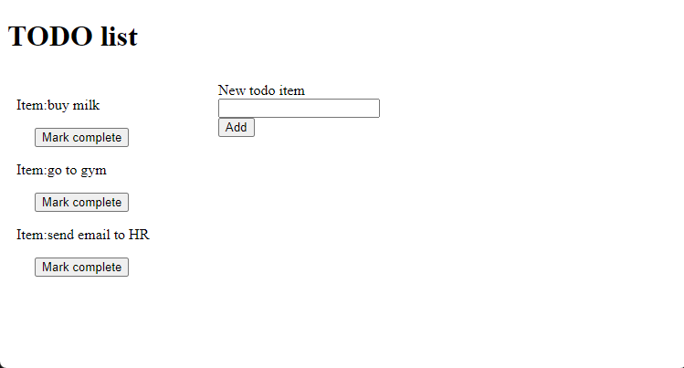
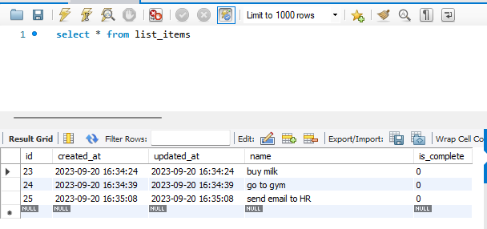

# Todo list project
### Based on course: https://www.youtube.com/watch?v=AEVhR-hD2Wk
End product:

Use cases:
1. as a user, I want to create item for a todo list
2. as a user, I want to mark items as complete and not to see them
3. as an admin, I want to see all items in MySQL database
### work order:
1. Install laravel environment: https://laravel.com/docs/4.2
2. Install MySQL DB: https://dev.mysql.com/downloads/mysql/
   1. use the username 'root' and password '1234'
3. Create laravel project: _composer create-project laravel/laravel todoList_
4. Create local db 
   1. _mysql> CREATE DATABASE todoList;_
   2. Use todoList db: _use todoList_
   3. Create 
   4. Show all items: _select * from list_items_
   
5. Set db in .env file:
   1. DB_DATABASE=todoList
   2. DB_USERNAME=root
   3. DB_PASSWORD=1234
6. Making model ListItem and Create migration
   1. Create model: _php artisan make:model ListItem -m_
   2. Make migration: _php artisan migrate_
   3. Check the migration folder: _database/migrations
      1. Delete all except of: /xxx_create_list_items_table.php_
      2. Add to migration file another columns:
         1. _$table->sting('name');_
         2. _$table->integer('is_complete');_
   4. Make migration again: _php artisan migrate_
      1. Make sure it is added to db
7. Starting the server: _php artisan serve_
8. Open http://127.0.0.1:8000/
9. Changed files:
   1. Rename welcome.blade.php to mainPage.blade.php. 
   2. resources/views/mainPage.blade.php 
   3. Http/Controllers/TodoListController.php
   4. .env
   5. database/migrations/2023_09_09_122035_create_list_items_table.php
   6. routes/web.php